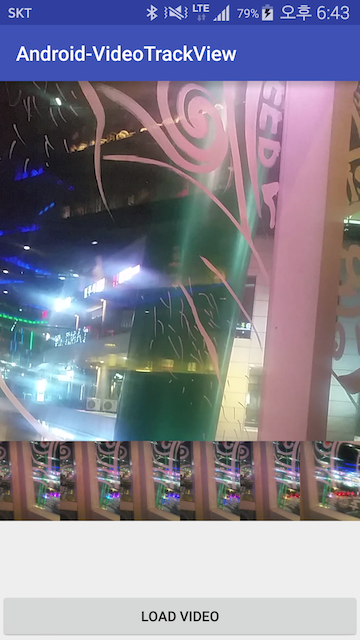

# Android-VideoTrackView
Android Video Track View

## Screenshot


## Example

add build.gradle<br />
``` groovy
compile 'com.crust87:video-track-view:1.2.1'
```

append your layout xml
```xml
<FrameLayout xmlns:android="http://schemas.android.com/apk/res/android"
    xmlns:app="http://schemas.android.com/apk/res-auto"
    xmlns:tools="http://schemas.android.com/tools"
    android:layout_width="match_parent"
    android:layout_height="match_parent" >

    <com.crust87.videotrackview.VideoTrackView
        android:id="@+id/videoTrackView"
        android:layout_width="match_parent"
        android:layout_height="88dp"
        app:screen_duration="30000"
        app:thumbnail_per_screen="6"
        app:track_padding="4dp" />

</FrameLayout>
```

request video
```java
Intent lIntent = new Intent(Intent.ACTION_PICK);
lIntent.setType("video/*");
lIntent.addFlags(Intent.FLAG_ACTIVITY_CLEAR_TOP);
startActivityForResult(lIntent, 1000);
```

and set video path
```java
mVideoTrackView.setVideo(path);
```

## VideoTrackOverlay Example
https://github.com/crust87/Android-VideoTrackView/blob/master/app/src/main/java/com/crust87/videotrackviewsample/AnchorOverlay.java

## License
Copyright 2015 Mabi

Licensed under the Apache License, Version 2.0 (the "License");<br/>
you may not use this work except in compliance with the License.<br/>
You may obtain a copy of the License at

http://www.apache.org/licenses/LICENSE-2.0

Unless required by applicable law or agreed to in writing, software<br/>
distributed under the License is distributed on an "AS IS" BASIS,<br/>
WITHOUT WARRANTIES OR CONDITIONS OF ANY KIND, either express or implied.<br/>
See the License for the specific language governing permissions and<br/>
limitations under the License.
